# ----C++

# ----基本语法

### 1. 多态

面向对象三大特性：封装，多态，继承。

https://blog.csdn.net/u014590757/article/details/79815831


##### 静态多态

​	函数重载，模板

##### 动态多态

​	虚函数

##### 宏多态

​	编译时替换，泛型。

##### 重写重载隐藏

​	重载：类中声明同名函数。

​	隐藏：派生类屏蔽基类同名函数，与参数列表无关。

​	重写（覆盖）：派生类重定义函数，函数名，返回值，参数列表一致。

##### 重载函数名字改编

​	name mangling符号改编

​	主要为了函数重载

​	函数名和参数列表决定名字。

​	仅当形参是引用或指针时，const形参才对符号名有影响。

### 2. 访问权限

### 3. 虚函数

C++ 多态的实现方式。子类重定义父类函数。实现动态调用函数。

https://cloud.tencent.com/developer/article/1599283

https://www.cnblogs.com/hushpa/p/5707475.html

#### 3.1虚函数表V-Table

​	如果对象存在虚函数，该类的大小就会多4个字节（一个指针的大小)，即编译器会生成一个指向虚函数表的指针。

所有的虚函数都存在于此虚函数表中，虚函数表为一个数组，每个单元用来存放虚函数的地址。

##### （1）位置

指针：虚函数表位于对象最前面

虚函数表属于类，类的所有对象共享这个类的虚函数表。 虚函数表由编译器在编译时生成，保存在可执行文件的只读数据段中  .rdata只读数据段。

##### （2）多重继承的派生类

含有多个虚函数指针。

##### （3）虚函数表创建时间

​	编译期创建。在编译的过程中编译器就为含有虚函数的类创建了虚函数表。

​	并且编译器会在构造函数中插入一段代码，这段代码用来给虚函数指针赋值。

##### （4）虚函数指针创建时间

​	运行时创建。由于虚函数指针是基于对象的，所以对象在实例化的时候，虚函数指针就会创建。

​	由于在实例化对象的时候会调用到构造函数，所以就会执行虚函数指针的赋值代码，从而将虚函数表的地址赋值给虚函数指针。

##### 	纯虚函数抽象基类

##### 	虚析构函数

​		基类指针只会执行基类虚函数，不会执行派生类虚函数。若为虚函数则执行派生类虚函数。

​		从静态声明处开始析构，直到基类。

##### 	基类指针调用虚函数的情况

​		域，默认直接为子类虚函数。

#### 3.2构造函数析构函数调用虚函数时

​	在当前类语义中只会调用当前类内的成员函数，不会动态多态。

​	且遵循正向构造 逆向析构的顺序。

#### 3.3纯虚函数

（1）构造函数调用纯虚函数

编译错误

https://www.thinbug.com/q/8642363

### 4. 引用与指针

#### 4.1功能含义

​	指针存地址，引用存变量别名.

​	引用的主要功能是传递函数的参数和返回值。

#### 4.2引用规则

​	（1）引用被创建的同时必须被初始化（指针则可以在任何时候被初始化）。

​	（2）不能有 NULL 引用，引用必须与合法的存储单元关联（指针则可以是 NULL）。

​	（3）一旦引用被初始化，就不能改变引用的关系（指针则可以随时改变所指的对象）。

#### 4.3返回局部指针

​	new在堆上分配，如不delete则可。引用为局部变量，在栈分配。

#### 4.4野指针

https://blog.csdn.net/qq_34528825/article/details/51920657

​	野指针不是 NULL指针，它是随即指向一块内存的指针

​	（1）野指针指向了一块没有访问权限的内存。（即指针没有初始化）

​	（2）野指针指向了一个已经释放的内存。

避免

尽量将指针初始化为NULL，用完后也可以将其赋值为NULL。

分配与释放

### 5. copy

https://www.cnblogs.com/wangguchangqing/p/6141743.html

#### 5.1拷贝构造函数与赋值运算符

（1）拷贝构造函数：

​		用一个对象的值初始化产生新的对象。

（2）拷贝构造函数主要场景

​		使用一个对象给另一个对象初始化

​		对象作为函数的参数，以值传递的方式传给函数。　

​		对象作为函数的返回值，以值的方式从函数返回

（3）赋值：

​		对已有的（已经存在的）对象进行赋值

#### 5.2深copy浅copy

深拷贝和浅拷贝主要是针对类中的**指针**和**动态分配的空间**来说的

默认生成的拷贝构造函数和赋值运算符为浅拷贝。指针也直接赋值。

#### 5.3 默认拷贝构造函数的原理

#### 5.4 什么情况需要自定义拷贝构造函数。

成员变量中有指针

### 6. new与malloc

https://www.cnblogs.com/qg-whz/p/5140930.html

new操作符从**自由存储区（free store）**上为对象动态分配内存空间，而malloc函数从**堆**上动态分配内存

new/delete不仅会 分配/释放 空间同时会  初始化/析构

new异常处理。

new 不用强制转换，自动匹配大小分配空间。

Delete[]

https://www.runoob.com/note/15971

https://www.cnblogs.com/hazir/p/new_and_delete.html

### 7.类

#### 7.1类内存布局

https://www.cnblogs.com/jiaochen/p/5524335.html

struct 的内存布局

Class 的内存布局

### 8.模板

https://blog.csdn.net/baidu_28312631/article/details/47975385

https://blog.csdn.net/qq_39108291/article/details/102019805?utm_medium=distribute.pc_relevant.none-task-blog-BlogCommendFromMachineLearnPai2-1.control&dist_request_id=&depth_1-utm_source=distribute.pc_relevant.none-task-blog-BlogCommendFromMachineLearnPai2-1.control

编译器并不是把函数模板处理成能够处理任意类的函数

编译器将函数模板根据具体类型产生不同的函数

编译器会对函数模板进行两次编译，在声明的地方对模板代码本身进行编译，在调用的地方对参数替换后的代码进行编译。


特化，全特化，偏特化

函数模板，却只有全特化，不能偏特化

https://zhuanlan.zhihu.com/p/72356532


https://www.jianshu.com/p/fc3fe1e01b42


模板类内可以又虚函数，但模板函数不能是虚函数。

https://blog.csdn.net/u011026037/article/details/80320953?utm_medium=distribute.pc_relevant.none-task-blog-baidujs_title-0&spm=1001.2101.3001.4242

### 9.智能指针

对于编译器来说，智能指针实际上是一个栈对象，并非指针类型，在栈对象生命期即将结束时，智能指针通过析构函数释放有它管理的堆内存，所以智能指针都重载了“operator->”操作符，直接返回对象的引用，用以操作对象

https://www.cnblogs.com/liumantang/p/12564151.html


忘记delete，抛出异常提前终止（过早return，离开当前作用域）


https://www.jianshu.com/p/cb3e574eee5f

哪个线程安全

智能指针包括一个实际数据指针和一个引用计数指针，这两个操作不是一个指令可以完成的，因此多线程环境下，势必有问题。

weak_ptr获得的shared_ptr可以安全使用，因为其[lock](https://links.jianshu.com/go?to=https%3A%2F%2Fen.cppreference.com%2Fw%2Fcpp%2Fmemory%2Fweak_ptr%2Flock)接口是原子性的，那么lock返回的是一个新的shared_ptr，不存在同一个shared_ptr的读写操作


1 同一个shared_ptr被多个线程“读”是安全的。

​	2 同一个shared_ptr被多个线程“写”是不安全的。 

​	3 共享引用计数的不同的shared_ptr被多个线程”写“ 是安全的。	

​		

​			


https://www.cnblogs.com/wxquare/p/4759020.html

对同一个shared_ptr的写操作不是线程安全的。 对使用同一份引用计数的不同shared_ptr是线程安全的

https://my.oschina.net/costaxu/blog/103119

引用计数

https://blog.csdn.net/hj605635529/article/details/76984839

#### 9.1类别

##### shared_ptr 

​	初始化：make_shared<>()，new直接初始化。

​	引用计数： 构造，函数传参，加一。

​						销毁（局部指针离开作用域），赋新值，减一。

​						销毁会调用析构函数，当引用数为0时，销毁数据。

​	出现异常：在离开作用域后自动销毁。而new，delete不会执行。

​	可使用自定义delete。

​	shared_ptr<int> p(&i,func)

​	不支持管理动态数组，除非定义删除器。

​	线程安全：使用引用计数本身是安全且无锁的，但对象读写不是。读写操作不原子化。

##### weak_ptr，循环引用

​	使用shared_ptr初始，并不会改变shared_ptr引用计数，weak_ptr指向对象可能会被释放。

​	可被shared_ptr/weak_ptr赋值，共享对象。

​	lock,返回一个shared_ptr

​	解决两个shared_ptr循环引用（不改变引用计数）。

##### unique_ptr

https://blog.csdn.net/u013378438/article/details/32209301

​	在函数参数中不能够按值传递unique_ptr、不能够将他传递给需要拷贝副本的STL算法使用

​	unique_ptr禁用了copy，而用move替代。

​	指向唯一对象，销毁时指向对象也被销毁。

​	new直接初始化。

​	release放弃所有权

​	禁止拷贝构造与赋值操作。

​	可存储在容器中，通过move。

​	可管理动态数组。int[]

​	std::unique_ptr默认构造会产生一个为NULL的指针。如vector resize时会出错。

unique_ptr什么时候会析构

##### auto_ptr

https://blog.csdn.net/gatieme/article/details/50939155

​	不能在容器中保存auto_ptr，不能从函数返回auto_ptr

​	复制和赋值会改变资源所有权。转移指针资源的所有权的同时将原指针置为NULL

​	在STL容器中无法使用auto_ptr,编译错误，容器中的元素必须支持可复制可赋值。

​	auto_ptr销毁对象，赋值：指针被销毁，指向对象被隐式销毁，离开作用域自动销毁，包括异常。

​												  拷贝值使原对象为空，移交所有权。

#### 9.2函数返回局部智能指针

复制构造函数会使计数+1

https://www.cnblogs.com/kilen/p/7128600.html

#### 9.3 weak_ptr的应用场景

#### 9.4 智能指针的计数器是放在哪的

### 10. 构造函数

默认构造函数

​	合成构造函数

​	委托构造函数

含参数构造函数

​	拷贝构造函数

​	移动构造函数


### 11. const，static，define

##### static

​	保持变量内容的持久。运行时为唯一一次初始化。

​	类的静态成员函数是属于整个类而非类的对象。没有this指针，它仅能访问类的静态数据和静态成员函数。


全局静态变量，局部静态变量，类内静态成员变量，静态函数。

https://blog.csdn.net/weixin_40539125/article/details/81938529

局部静态变量：局部静态变量跟全局变量一样很早就存在于全局数据区。但当第一次运行到该函数，会检测一个位，来判断是否已经初始化。初始化是在第一次执行时处理

全局/静态存储区在编译过程中就已经生成在执行文件中


##### 	const

​		https://blog.csdn.net/u011980566/article/details/51523817?utm_medium=distribute.pc_relevant.none-task-blog-baidujs_baidulandingword-0&spm=1001.2101.3001.4242


​		顶层const：指针是常量。

```c++
const int* ptr;
```

​		底层const：(指针)所指对象为常量。

​							 引用的const为底层const

```c++
int *const ptr;
const int a;
const int &r;	
```

成员函数不同位置

https://blog.csdn.net/baidu_35679960/article/details/83504018

返回类型为const

函数参数是const

该函数是const

##### const 与define

#define为常数不带类型

#define在预处理阶段起作用，const在编译运行时起作用

define是简单的字符串替换没有类型检查，const有对应的数据类型。

define占用代码段空间，const占用数据段空间。

const可进行调试，define不可进行调试

define可进行重定义，const不能重定义

define可用来防止头文件重复引用


### 12. 内存分区/内存模型

（1）内存分配

https://blog.csdn.net/gfgdsg/article/details/42709943

https://www.cnblogs.com/cxuanblog/p/13390654.html


代码段，数据段，bss段，堆，栈。

内存溢出原因


子类实例内存模型

类内存布局

内存管理：堆，栈，自由存储区，静态存储区。


##### 内存格局：

​	全局数据区：全局变量，静态数据，常量。类全局变量。

​	代码区：类成员函数，非成员函数代码

​	栈区：运行函数分配的局部变量，函数参数，返回数据，返回地址。

​	堆区（自由存储区）：

​			

​	非静态成员变量。构造函数会实例化，为每个对象生成一份拷贝。分配到栈区或堆区。

​	类非静态成员函数包含一个指向类对象的指针参数。this。

​	new对象只是分配成员变量，普通成员函数未使用成员变量可正常工作(类似static)。

​	但new没有初始虚函数指针，因此没有new无法调用虚函数

​	成员函数是否内联都不占用对象存储空间。内敛是调用时赋值代码。

​	对象只包含自己的数据(包括虚函数指针，虚基类指针)。

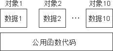

​	结构偏移：最后的大小必须为类中最大成员长度的倍数。

​						作为其他类型成员，按照最大成员长度对齐。


##### 10.1影响对象大小因素

​	成员变量

​	虚函数表指针 vftptr

​	虚基类表指针 _vbtptr

​	内存对齐

##### 10.2空类

sizeof(A)=1	用于标识该对象

```c++
class A{}
```

##### 10.3只有成员变量的类

sizeof(B)=4*3=12

```c++
class B{
	int a;
	int b;
	int c;
}
```

##### 10.4只有虚函数的类

sizeof(C)=4 虚表指针

```c++
class C{
	virtual void f();
	virtual void g();
	virtual void h();
}
```

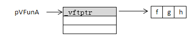

##### 10.5成员变量和虚函数

sizeof(D)=4+4	成员+虚表指针

```c++
class D{
	int m_nAge;
	virtual void f0();
	virtual void g0();
	virtual void h0();
}
```


##### 10.6单一继承

sizeof(E)=sizeof(D)+4=8+4=12

```C++
class E:public D{
    int m_nChildren;
    virtual void f0();
    virtual void g1();
    virtual void h0();
} 
```

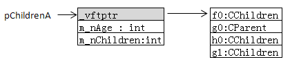

虚表重复的进行覆盖，不重复的添加。

##### 10.7多继承

sizeof(C)=sizeof(A)+sizeof(B)+4=(4+4)+(4+2+2)+4=20

```c++
class CParent1{
    int m_nParent1;
    virtual void f0();
    virtual void g0();
    virtual void h0();
}
class CParent2{
    short m_nParent2;
    virtual void f1();
    virtual void g1();
    virtual void h1();
}
class CChildren:public CParent1,public CParent2{
    int m_nChildren;
    virtual void f0();
    virtual void g1();
    virtual void f2();	//
    virtual void h0();
    virtual void h1();
    virtual void h2();	//
}
```

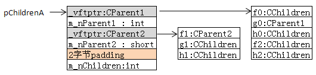

##### 10.8深度为2的继承

sizeof(D)=sizeof(C)+4=20+4=24

```c++
class GrandChildren:public CChildren{
	int m_nGrandChildren;
    virtual void f0();
    virtual void h1();
    virtual void f2();
    virtual void f3();
}
```

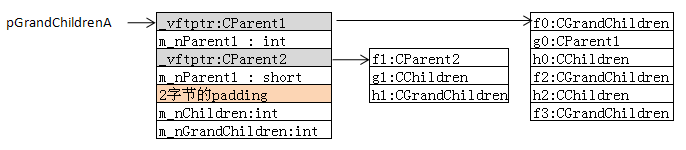

##### 10.9重复继承

​	继承多个虚表指针。进行覆盖。但是根基类会被重复拷贝。

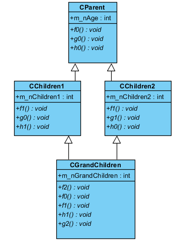

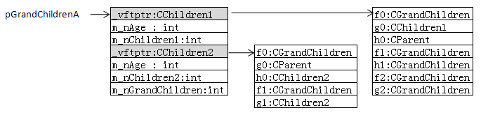

##### 10.10单一虚继承

sizeof(CChildren)=20

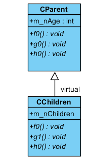

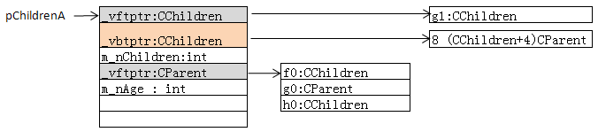

##### 10.11多虚继承

(1)virtual Cparent1,CParent2

sizeof(CChildren)=24

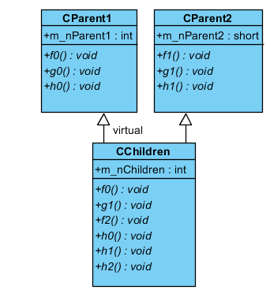

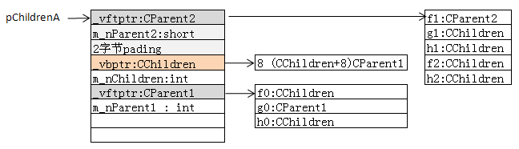

(2)CParent1,virtual CParent2

sizeof(CChildren)=24

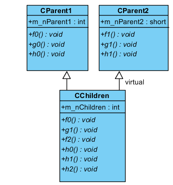

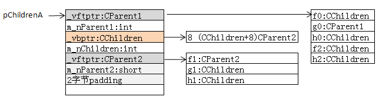

(3)virtual CParent1,virtual CParent2

sizeof(CChildren)=28

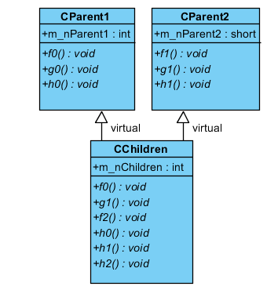

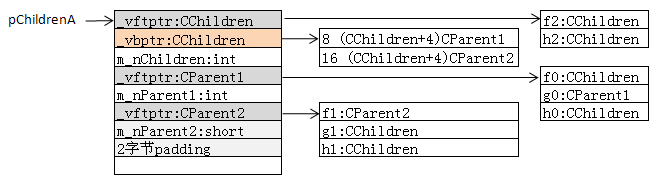

##### 10.12菱形虚多继承

sizeof(CChildren)=36

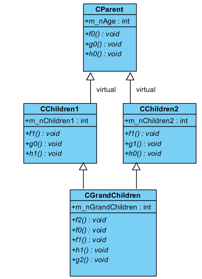

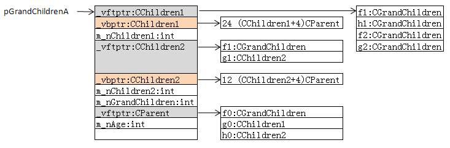


### 13. 析构函数

1。显式调用的时候，析构函数相当于的一个普通的成员函数

2。编译器隐式调用析构函数，如分配了堆内存，显式调用析构的话引起重复释放堆内存的异常

3。把一个对象看作占用了部分栈内存，占用了部分堆内存（如果申请了的话），这样便于理解这个问题      

系统隐式调用析构函数的时候，会加入释放栈内存的动作（而堆内存则由用户手工的释放）      

用户显式调用析构函数的时候，只是单纯执行析构函数内的语句，不会释放栈内存，摧毁对象


虚析构函数

​	从显示的类型处开始析构，从子类到父类。


### 14. allocator

memory头文件

```c++
allocator<> a;					//为类型__分配内存
auto const ptr=a.allocate(n);	//分配一段原始的未构造的内存，保存n个类型为T的对象。
a.construct(ptr,args);			//ptr为T*指针，传递构造函数。
destory(ptr);					//执行ptr指向对象的析构函数。
a.deallocate(p,n);				//释放内存。
```


### 15. extern

https://blog.csdn.net/fengbingchun/article/details/78941738

static 限制了变量的作用域只在该文件里

extern可以被其他类所访问。作用范围是整个工程

### 18.可调对象

函数

函数指针

lambda表达式

bind创建的对象

重载了函数调用符的类。函数对象。

### 19.#include 与 命名空间

​	#include：全部复制到目标位置。

### 20. union 联合体

所有变量起始地址相同，使用覆盖技术

用途：以bit拆分存储数据。判断大小端。

union里也不允许存放带有构造函数、析构函数和复制构造函数等的类的对象，但是可以存放对应的类对象指针

https://blog.csdn.net/Qsir/article/details/86507647

### 22.内存溢出原因

https://www.jianshu.com/p/5770c067a552

### 23.memcpy与memmove区别

https://www.jianshu.com/p/9c3784d8d8ad

（1）作用

​	为逐一拷贝 一定长度 的内容。

（2）区别

​	内存重叠时（src在dest前，且部分重叠）。memmove更安全，保证正确

（3）memmove

​	对拷贝的数据作检查，确保内存没有覆盖，如果发现会覆盖数据，简单的实现是调转开始拷贝的位置，从尾部开始拷贝。src与dest相反则正向拷贝。若地址相等则不拷贝。

但是实际在C99实现中，是将内容拷贝到临时空间，再拷贝到目标地址中

### 24.strncpy

https://www.cnblogs.com/qingergege/p/5969571.html

#### 24.1strcpy

​	把从src地址开始且含有'\0'结束符的字符串复制到以dest开始的地址空间。如dest不够用，会造成程序访问未知的内存空间（缓存溢出），给程序带来不确定性。不安全。

#### 24.2strncpy

 	将源字符串前n字符拷贝到目标。相对于strcpy函数多了一个表示可拷贝的最大字符数的参数。这样在很大程度上就能避免strcpy函数的不足（程序员在用strncpy时，需要填写拷贝个数，这时程序员就很肯能会检查一下dest是否有足够的内存）。

​	若源字符串小于n，则会拷贝源字符串并将目标字符串剩下部分全部置\0

​	目标字符串 长度大于n，目标字符串不会拷贝结尾\0。需要最后手动添加\0

### 25.右值引用 && 

等号右边的值

解决的问题：当参数为右值时，解决了不必要的深拷贝。

https://www.zhihu.com/question/22111546


完美转发：可使得左值和右值性质不变。 std::forward

1、T& + & = T&
2、T& + && = T&
3、T&& + & = T&
4、T或T&& + && = T&&

https://blog.csdn.net/liujiayu2/article/details/49279419

### 26.类型转换函数

https://www.jianshu.com/p/6ebc3c31c491

https://www.jianshu.com/p/5163a2678171

#### 	26.1 static_cast

​		编译器认可的隐式类型转换

​		static_cast<>()

#### 	26.2 dynamic_cast

https://blog.csdn.net/qq_30392565/article/details/51882630?utm_medium=distribute.pc_relevant.none-task-blog-baidujs_title-0&spm=1001.2101.3001.4242


​		派生类指针或引用，与基类指针或引用转换。

​		运行时处理，运行时要进行运行时类型检查，其他三个类型转换是编译时完成。

​		基类中要有虚函数，因为运行时类型检查的类型信息在虚函数表中，有虚函数才会有虚函数表；

​		可以实现向上转型和向下转型，前提是必须使用public或protected继承；

#### 	26.3 const_cast

​		只改变运算对象的底层const。

​		去掉const

常量指针被转化成非常量指针，并且仍然指向原来的对象；
常量引用被转换成非常量引用，并且仍然指向原来的对象；

#### 	26.4 reinterpret_cast

​		重新解释的类型转换

​		对任意两个类型之间的变量相互转换，无视类型信息。

### 27.默认参数为什么放到最后

​	https://blog.csdn.net/Young__Fan/article/details/82730659

​	形参的压栈先后顺序，由后向前。

### 28.纯虚函数抽象基类

### 29.lambda


https://www.jianshu.com/p/d686ad9de817

原理：

https://blog.csdn.net/weixin_39640298/article/details/84996642?utm_medium=distribute.pc_relevant.none-task-blog-BlogCommendFromMachineLearnPai2-2.control&dist_request_id=&depth_1-utm_source=distribute.pc_relevant.none-task-blog-BlogCommendFromMachineLearnPai2-2.control

效率：优于函数指针。

编译器转换成类，调用时会调用对象函数：void operator() const

值捕获：作为lambda生成类的函数的参数

引用捕获：引用变量会成为lambda生成类的成员对象。构造函数中会进行初始化。

### 30.友元

其他类/函数可访问非公有成员

不存在传递性，每个类负责控制自己的友元类/函数。

### 31.std:move 与std:forward

##### 	std:move

​		将左值引用转为右值引用

##### 	std:forward

​		接受一个右值引用的参数

​		将所有的参数类型原封不动的传递给目标函数


### 32.可变长参数

标准库	initialiazer_list:实参数量未知，但类型相同。

```
	initializer_list<String> SS
	包含begin end函数。
```

省略符：  参数列表最后位置添加： ...


可变参数模板：实现任意长度、任意类型参数

变长参数模板的典型使用方法：利用模板推导机制，每次从参数包里面取第一个元素，缩短参数包，直到包为空。

```c++
template<typename T, typename... Targs>
void tprintf(const char* format, T value, Targs... Fargs) {
   // recursive variadic function
   for (; *format != '\0'; format++) {
       if ( *format == '%' ) {
          std::cout << value;
           tprintf(format+1, Fargs...); // recursive call
           return;
        }
        std::cout << *format;
    }
}
```

### 33.C++函数调用约定

https://blog.csdn.net/weixin_39731083/article/details/82533349

### 34栈和堆

栈里除了局部变量还会存什么

函数调用的过程

1. 内存分哪五大区

装箱拆箱

map和unordered_map

https://blog.csdn.net/WU9797/article/details/95075133

### 35.PE文件

​	PE（Portable Execute）文件是Windows下可执行文件的总称，常见的有DLL，EXE，OCX，SYS等。PE文件可以是任何扩展名


### 36.异常机制与异常对象

https://www.cnblogs.com/QG-whz/p/5136883.html

throw异常后，throw之后的语句不执行，直接return。

当异常对象与catch语句成功匹配上后，在该catch语句的结束处被自动析构。

### 37.三种继承

交叉继承（虚继承）

### 38. auto

类型推导

https://cloud.tencent.com/developer/article/1637075

限制

​	不能用于函数参数声明，静态，数组，模板参数。

https://blog.csdn.net/WLFIGHTER/article/details/50412761

### 39.函数参数入栈顺序

从右向左

C/C++要求在声明参数可变的函数时，需要有至少一个确定的参数。

https://blog.csdn.net/jiange_zh/article/details/47381597

### 40.函数调用约定

https://blog.csdn.net/xt_xiaotian/article/details/5363633

### 41.虚函数表与Thunk

运行时对象查虚函数表

https://blog.csdn.net/paradox_1_0/article/details/103636339

https://www.jianshu.com/p/f5ef5f1fe158

多继承：thunk

### 42. struct 内存对齐

https://zhuanlan.zhihu.com/p/30007037


（1）结构体变量的**起始地址**能够被其最宽的成员大小整除

（2）结构体每个成员相对于**起始地址的偏移**能够被其**自身大小整除**，如果不能则在**前一个成员后面**补充字节

（3）结构体总体大小能够**被最宽的成员的大小**整除，如不能则在**后面**补充字节

# ----STL

## 1.vector

### 1.1 与数组区别

​	vector相对于数组支持动态扩容，可以用size获取vector的长度

### 1.2 size与capacity区别

https://blog.csdn.net/qq_30835655/article/details/60762196

返回对象缓冲区（vector维护的内存空间）实际申请的空间大小，另一个**size()**，返回当前对象缓冲区存储数据的个数。对于vector来说，capacity是永远大于等于size的，档capacity和size相等时，vector就会扩容，**capacity**变大

### 1.3 如何动态分配内存


### 1.3 与list区别

​	vector动态数组，内存连续。高效的进行随机存取，时间复杂度为O(1)。

​	list双向链表，内存空间不连续，存取时间O(n)，高效的进行插入删除。

### 1.4 clear函数细节

clear（）函数的调用方式是，vector<datatype> temp（50）;//定义了50个datatype大小的空间。temp.clear();

作用：将会清空temp中的所有元素，包括temp开辟的空间（size），但是capacity会保留，即不可以以temp[1]这种形式赋初值，只能通过temp.push_back(value)的形式赋初值。

同样对于vector<vector<datatype> > temp1（50）这种类型的变量，使用temp1.clear()之后将会不能用temp1[1].push_back(value)进行赋初值，只能使用temp1.push_back(temp)；的形式。

### 1.5 push_back

​	push_back时间复杂度：m/m-1  常量时间。

## 2.list

http://c.biancheng.net/view/6955.html

## 3.map set

https://www.jianshu.com/p/56bb01df8ac7

https://blog.csdn.net/zhc_24/article/details/80272437

（1）底层实现

map与set不包含重复的数据。map含key与value。

set，map：红黑树（有序）

unordered_map：hash加链表，空间换时间。

（2）插入删除复杂度

map： O(logN)

unordered_map：O(1)，最坏情况O(N)。


Key不存在

https://blog.csdn.net/pzhw520hchy/article/details/77945713


插入相同Key： insert()插入元素的方式并不能覆盖掉相同key的值；而使用[]方式则可以覆盖掉之前的值。

https://blog.csdn.net/zhoucheng05_13/article/details/81013684


## 4.哈希

冲突解决

https://www.jianshu.com/p/4d3cb99d7580

## 5.STL迭代器失效

容器插入删除可能会导致迭代器失效。

vector

​	插入一个元素后，end操作方位的迭代器失效。

​	插入一个元素后，capacity返回值发生变化，first和end操作返回的迭代器都会失效。

​	进行删除操作后，指向删除点的迭代器将失效，指向删除点后面的元素的迭代器也将失效。

deque

​	在容器首部和尾部插入元素不会使迭代器失效。

​	在首部或尾部删除元素会使指向被删除元素的迭代器失效。

​	在容器的任何位置插入或删除操作将会使指向该容器元素的所有迭代器失效。

list/set/multiset/map/multimap

​	删除元素时，指向该元素的迭代器失效。

## 6.STL线程安全

## 7.map

https://blog.csdn.net/u013195320/article/details/23046305?utm_medium=distribute.pc_relevant_t0.none-task-blog-BlogCommendFromMachineLearnPai2-1.control&dist_request_id=&depth_1-utm_source=distribute.pc_relevant_t0.none-task-blog-BlogCommendFromMachineLearnPai2-1.control


负载因子 = 容器存储的总键值对 / 桶数

https://blog.csdn.net/yptsqc/article/details/107401162

## 8.时间复杂度

https://blog.csdn.net/bandaoyu/article/details/87620959?utm_medium=distribute.pc_relevant.none-task-blog-baidujs_title-0&spm=1001.2101.3001.4242

## 9. deque

https://blog.csdn.net/gogokongyin/article/details/51178378


# ----编译

### 1. h与cpp文件

​	h文件不对外隐藏，cpp文件编译后对外隐藏。

### 2.编译，链接

​	动态链接

##### 21.1预编译

​	.cpp文件生成 .i文件

​	(1)展开宏：#define 全部替换。

​	(2)处理预编译指令：#if #ifndef  #else  #endif 

​									（条件编译可执行条件选择，从而保证头文件只include一次）

​	(3)删除所有注释：/**/  //

​	(4)添加行号和文件名标识：便于编译时编译器产生调试行号信息和错误提醒。

​	(5)保留所有#pragma

​	(6)#include 替换为对应文件内容。

​		#include存放声明，因此放在cpp文件开始部分。

​		搜索头文件顺序

​			#include<> :从系统目录下开始搜索，然后搜索PATH环境变量所列出的目录，不搜索当前目录。

​			#include""  :从当前目录搜索，c++安装目录，然后系统目录和PATH环境变量所列出的目录

​			如果知道头文件在系统目录或PATH目录下，可通过<>加快搜索速度。

##### 21.2编译

​	.i文件生成.s文件，生成汇编代码。

​	词法分析，语法分析，语义分析，代码优化，代码生成。

##### 21.3汇编

​	.s生成.obj文件。机器码文件。

​	未解决符号表：提供所有在该编译单元里引用但定义并不在本编译单元里的符号及其出现的地址。 

​	导出符号表：提供了本编译单元具有定义，并且愿意提供给其他编译单元使用的符号及其地址。 

​	地址重定向表：提供了本编译单元所有对自身地址的引用的记录。	

##### 21.4链接

​	链接.obj文件，产生可执行文件	

​	决定各个.obj文件在最终exe文件的位置

​	访问地址重定向表，进行地址重定向。加上偏移量。

​	遍历所有目标文件的未解决符号表，在导出符号表查找符号。

​	在未解决符号表中所记录的位置填写实现地址。


##### 静态链接

​	在链接阶段，将源文件中用到的库函数与汇编生成的目标文件.o合并生成可执行文件。

​	方便程序移植，在任何环境都可执行。

##### 动态链接

​	编译后只将声明部分编译到程序中，运行时需要dll（实现部分）文件支持。

​	优点：

​    （1）多个程序可以共享同一段代码，而不需要在磁盘上存储多个拷贝。

​    （2）动态的加载需要的资源和函数，而不是一开始就加载，不需要一开始就为这些资源开辟内存空间，节省内存，提升效率。


