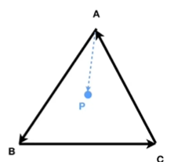

# ----图形学

## 1.渲染管线

forward shading 与defered shading 优劣

https://zhuanlan.zhihu.com/p/79183044

https://zhuanlan.zhihu.com/p/137780634

https://zhuanlan.zhihu.com/p/61949898

### 1.1 应用阶段

​	定义光源信息，视角信息，渲染模型图元，传递给GPU。

​	碰撞检测：物体是否重叠。

### 1.2 几何阶段 

#### 1.2.1顶点渲染

##### （1）视角转换（必选）

​		计算顶点位置，将顶点从模型空间转为视角空间。

​		Vertex Shader 计算每个顶点位置。根据指令，对顶点添加信息/做出修改。

##### （2）光照，动画，材质坐标等

​		光照：对每个顶点计算对应光照。

​		动画：改变顶点位置

​		视角转换：

##### （3）镶嵌（可选）

​			添加更多顶点，精细化模型。嵌入三角形。

Hull Shader：将控制点信息发往Domain Shader，同时也会给Tessellator一些系数，告诉Tessellator具体的细分级别。

最后Domain Shader再将所有接收到的信息进行整合，就可以完成整个Tessellation流程，生成我们想要的新的模型

##### （4）几何渲染 Shader （可选）

​		在图元外添加额外的顶点，将原始图元转换成新图元

​		粒子系统：

#### 1.2.2投影

​	透视投影，正交投影。

​	将3D投影到2D  。Z坐标信息都会存储在z-buffer中，后续的阶段会使用。

#### 1.2.3裁剪

​	剔除视野外的物体（三角形）。unit-cube

#### 1.2.4屏幕映射

​	将unit-cube坐标转换为屏幕坐标。

### 1.3光栅化

图元转为像素

#### 1.3.1三角形设置

​	计算图元的边方程和一些其他信息。将各个点连接形成三角形。

#### 1.3.2三角形遍历

​	识别图元覆盖的像素。

### 1.4像素处理

#### 1.4.1像素着色 Fragment Shader

​	为每个像素赋予颜色。纹理（通过三个顶点获取纹理块），顶点信息和光照信息（每个顶点含光照阴影信息，其内的点通过三个顶点的差值获得）

#### 1.4.2色彩融合

​	整合像素信息。遮挡，融合。Alpha Test, Stencil Test, Depth Test。

​		每个像素有相应的颜色信息，存储在Color buffer。

​		每个像素含Z-buffer信息，Alpha透明度信息。

## 2.PBR算法

## 3.光照实现

## 4.像素着色器，

## 5.透明物体需要注意什么

渲染顺序

## 6.四叉树八叉树

## 7.延迟渲染与前向渲染

遮挡剔除详细

延迟渲染的过程，GBuffer，相比前向渲染的优势和劣势

延迟渲染和前向渲染的区别，时间复杂度的比较

https://zhuanlan.zhihu.com/p/111314574

https://zhuanlan.zhihu.com/p/102134614

## 8.深度测试/模版测试/透明度测试先后顺序

https://www.zhihu.com/question/384124671

裁剪测试：如果一个点在裁剪区域外，我希望它彻底不渲染，也不要对缓冲区造成任何影响，所以优先级最高

Alpha测试：优先于模板测试，当我们希望用一个不规则的图片进行模板的裁剪的时候，应该使用Alpha测试先过滤掉那些透明的片段，我们只希望剩下的不透明片段来更新模板缓存

模板测试：我希望对模板值进行一些更新，所以哪怕我被其它东西挡住，导致这个片段显示不出来，我也要把模板值更新进去

深度测试：最后决定这个片段是否渲染

## 9.MipMap贴图

贴图渲染

为了加快渲染速度和减少图像锯齿，贴图被处理成由一系列被预先计算和优化过的图片组成的文件

## 10.高斯模糊的优化方式

## 11.异面直线距离

https://blog.csdn.net/songyunli1111/article/details/101560782

## 12点乘和叉乘

（叉乘：判断点是否在三角形内）

AB XAP   BC X BP    CA X CP 方向均相同，均在左侧。则在三角形内。

点乘：求夹角。投影（根据投影向量和原向量，获得垂直向量），cosΘ 方向

将一个向量转为一个坐标系内。

叉乘：判定左右，判定内外。法向量。 |aXb| = |a||b|sinΘ

## 13.光线追踪

https://zhuanlan.zhihu.com/p/41269520

## 14.Phong光照

https://zhuanlan.zhihu.com/p/144331612

## 15.场景剔除

可见剔除(距离剔除、视锥体剔除)

遮挡剔除(遮挡查询、Early Z)

# UE4

UE4的反射系统

Unreal Header Tool

UE4蓝图如何调用C++函数（底层原理）

UE4的GC，耗时

UE4的渲染流程（ParticleSystem PreRender->Z-PrePass->Occlusion Culling->Hierarchical Z Buffer->Shadow depth->BasePass(Gbuffer)->Lighting->Translucency）

断线重连

UE4的动态合批与静态合批

UE4的Gameplay框架

寻路算法

actor、pawn、character的区别

# ----图形学基础知识点

法向量变换：正交变换可行。

层次建模，矩阵栈

正向运动学，逆向运动学

三维旋转：Euler角，四元数

质点/粒子系统。常微分方程

布林冯模型 

 N·L（cosθ）的物理意义（朗伯余弦定律） 

 半球积分的计算 

 透视投影矩阵（作用、推导） 

 GPU渲染管线 

 渲染管线中输入装配器阶段的图元拓扑 

 质心插值 

 贴图UV与法线贴图 

 顶点着色器阶段可以处理的数据 

 顶点着色器阶段不能处理的数据（数学原理） 

 像素着色器 

 深度测试与Early-Z

### 光线投射

遍历每个像素->遍历每个物体。

核心：求交，求法线

##### 光线

​	P(t)=R0+t*Rd

##### 平面

​	n*P+D=0

##### 球

​	P* P-r* r=0

##### 三角形

​	质心坐标：P=α *a+ β *b +γ * c                       α + β +γ=1

​	当 β+γ <1 & β>0 & γ>0时得交点

​	R0+t*Rd=α *a+ β *b +γ * c  

### BRDF双向反射分布函数

反射比率

理想漫反射：

​			kd 漫反射系数，n 面法向， l 光源方向，指向光源， Li 光强 ，r 与光源的距离

​			n*l 需大于0，否则直接取0。

##### Phong模型

​	高光反射

​	Ks：镜面反射系数，q：镜面反射指数项

​	

##### 镜面反射方向

​	

漫反射+高光反射+环境光

##### 变换法向量

##### 反射

##### 加速

阴影，软阴影

反走样

运动模糊

包围盒：减少光线相交检测数，提前拒绝

层次化网格，四叉树/八叉树

##### 流水线

投影每个结点

光栅化三角形

对每个像素计算颜色

检测可见性，更新帧缓存

几何变换

光栅化

纹理映射

片元计算

显示

高斯模糊

阴影的做法 除了shadowmap还有啥

阴影

Shadowmap

剔除

如何将一个3D物体映射到2D屏幕上

如何求矩阵的逆；逆矩阵有什么性质

纹理填充率对性能的影响

drawcall的概念；底层上怎么减少drawcall；

https://zhuanlan.zhihu.com/p/304727816

法线贴图

光照模型有过哪些

粒子模型

几何着色器和细分着色器顶点着色器

深度测试有办法提前吗，为什么要提前，怎么提前的（Early-Z）

透明物体的渲染顺序，为什么透明物体要从后往前渲染

走样：

锯齿边界，渲染细节错误，纹理错误。

# ----Shader

### 1.渲染管线

顶点shader

片段shader

### 2.向量

点乘

叉乘

### 3.同步

状态同步：服务端计算行为结果后转发。

帧同步：服务端转发行为，客户端计算。

### 4.alphaTest

原理

### 5.特征值特征向量几何意义

### 6.PBR基于物理渲染

### 7.PRDF

 前向渲染和延迟渲染区别