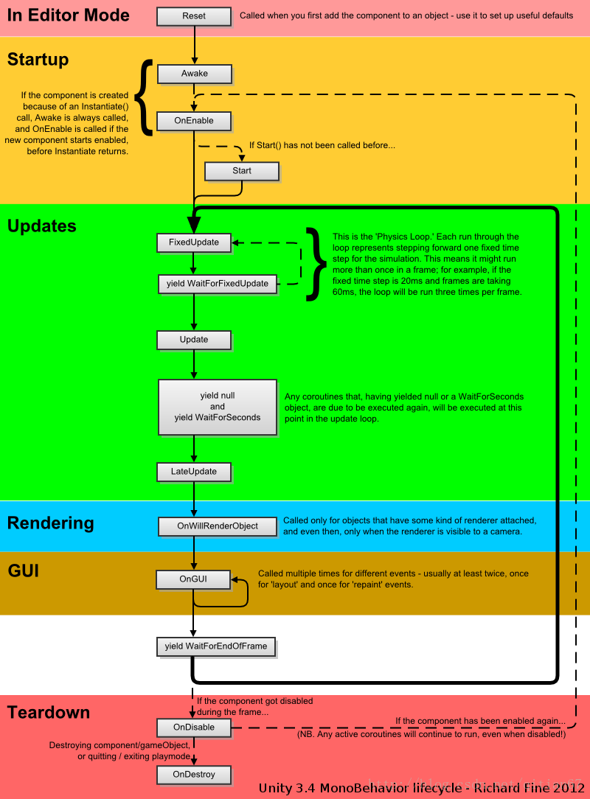

# ----Unity

## 1.碰撞器与触发器

## 2.碰撞的必要条件

## 3.Monobehaver生命周期

Awake：当一个脚本实例被载入时调用。大多在这个类中完成成员变量的初始化

OnEnable：当对象变为可用或激活状态时此函数被调用。

Start：仅在Update函数第一次被调用前调用，在Awake之后被调用的。

Update：每帧调用。刷新时间是不规律。

FixedUpdate：每固定帧调用。同一次循环中出现FixedUpdate和Update那么FixedUpdate优先。

LateUpdate：所有Update调用后调用

OnGUI：渲染和处理GUI事件时调用

OnDisable：对象变为不可用或非激活状态时调用

OnDestroy：MonoBehavior被销毁时调用

## 4.光源

## 5.

# UGUI

### 1.Pivot

### 2.Anchors

点：中心相对anchors的位置，且保持不变。

拉伸：各边离anchors的距离

​			与父物体缩放比例一致

快捷键：

​	平移：ctrl

​	缩放：shift

​	一起平移：ctrl+shift

​	Anchor Presets

​	设置Anchor与pivot：shift

​	设置Anchor与position：Alt

### 3.EventSystem

事件系统管理器

### 4.Standalone Input Module

标准接收器

### 5.Touch Input Module

触屏接收器

# ----C#

## 1.C#委托与事件

## 2.GC

### 3.yield return

逐帧轮询

### 4.C#

闭包

反射

委托

### 5.协程

### 6.后处理