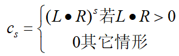
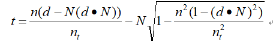
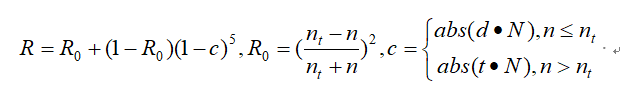

图形学

贝塞尔曲线与b样条编辑器与转换，曲面建模

实现一个矩阵栈以模拟人物骨骼层次模型transform改变，以及人物模型蒙皮。

## 布料粒子系统

内容：

（1）时间积分器，实现常微分方程数值解法： Euler法，梯形法。

（2）实现一个8*8个质点的粒子系统。之间有结构力、抗剪力、抗弯力三种弹簧力。

步骤：

（1）每 0.04 s 绘制粒子系统（三角，点，法向量）

（2）每帧根据受力计算并更新各个质点的位置和速度。

## 光线投射与光线跟踪

实现透视相机，生成光线，并与基本图元求交。采样光线交点处的颜色。

漫反射，高光反射，折射镜面反射。递归光线。

简单实现了uv贴图，并且使用perlin噪声去让程序生成纹理，模拟大理石贴图。
然后最后为了让生成的图片更真实，使用了抖动采样+高斯模糊。

（1）求交

​		Object3D基类。含求交纯虚函数（光线Ray，传出hit点，tmin）。

​		求交并判断距离（t）是否更近，更新hit、材质与texCoord（材质坐标）（三角形）。

​			球体：球心，半径。

​			平面：隐式公式，nP + d

​			三角形：质心坐标求交。存三个点位置，材质坐标。

​			Group：多个Object。

​			Mesh：已给定，多个三角形。

​			变换： 未变换物体 与变换矩阵m。m逆矩阵变换原光线再求交。 且需变换法向量

​								nWS= (**m-1**)T  nOS

（2）光照

漫反射：法向量 · 光照光线 · 参数

n.L  x 漫反射颜色 x 光照

​	

高光：  （光照反射光线 · 视角光线）^系数

光线跟踪

（1）递归光线

​	设置最大弹回次数，递归进行光线追踪，每次光照求交再生成反射光与折射光（递归求解），再对贡献累加。

​	用于计算阴影、反射、折射。

​		a)阴影投射：向每个光源发送光线检查这些光线是否与物体相交。如果存在交点，丢弃该光源的贡献	

​		b)反射材质实现镜面反射

​		c)简单折射. 对透明材质投射折射光

​	

n（当前折射系数）和nt（将进入的物体折射系数）是二种介质的折射率

折射方向t：

混合反射和折射光的颜色，使用Schlick对Fresnel方程的近似。反射颜色的权重R，而对折射颜色使用1−R

R求法:

（2）Perlin噪声

伪随机噪声，取一大块随机值并模糊它所得到外观效果。

公式：M(x, y, z)= sin(ωx + aN(x, y, z))

N(x, y, z) ： PerlinNoise::octaveNoise

​					(x, y, z)是全局坐标 

​					N(x, y, z)= noise(x, y, z)+ noise(2x, 2y, 2z)/2+ noise(4x, 4y, 4z)/4+ ..., 

频率为w幅值为a

（3）反走样

抖动走样：每个象素使用随机扰动后的多条光线采样来代替一条光线得到的颜色。相当于3倍分辨率来渲染图像

高斯模糊：使用两个核，对图像横向和纵向模糊。

最后下采样，对像素平均求和得到最终颜色。

## UE4

### Survivors

(1)场景

LandScape

海洋：材质。后处理。

雨滴

时间：昼夜交替

物品拾取与使用：定义一个类BP_Item。根据配表动态加载

建筑系统

简单人物控制：移动，奔跑切换

​							动画状态机

UI显示。

### DiceTown

为了解UE4 框架。尝试去做一些UObject的同步。

